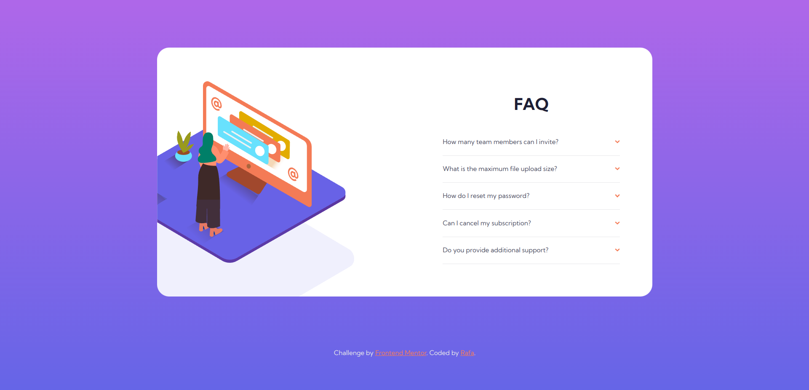

# Frontend Mentor - FAQ accordion card solution

This is a solution to the [FAQ accordion card challenge on Frontend Mentor](https://www.frontendmentor.io/challenges/faq-accordion-card-XlyjD0Oam). Frontend Mentor challenges help you improve your coding skills by building realistic projects. 

## Table of contents

- [Overview](#overview)
  - [The challenge](#the-challenge)
  - [Screenshot](#screenshot)
- [My process](#my-process)
  - [Built with](#built-with)
  - [Links](#links)

## Overview

### The challenge

Users should be able to:

- View the optimal layout for the component depending on their device's screen size
- See hover states for all interactive elements on the page
- Hide/Show the answer to a question when the question is clicked

### Screenshot

### Links

- Solution URL: [GitHub repository](https://github.com/rafacovez/FAQ-accordion-card)
- Live Site URL: [Live site](https://faq-accordion-card-omega-liard.vercel.app)

## My process

### Built with

- Semantic HTML5 markup
- CSS custom properties
- Flexbox
- CSS BEM methodology
- Mobile-first workflow
- JavaScript

## Author

- Frontend Mentor - [@rafdidact](https://www.frontendmentor.io/profile/rafdidact)
- FreeCodeCamp - [@rafacovez](https://www.freecodecamp.org/rafacovez)
- StackOverflow - [@rafacovez](https://stackoverflow.com/users/15068150/ad%c3%a1n-est%c3%a9vez)
- LeetCode - [@rafacovez](https://leetcode.com/rafacovez/)